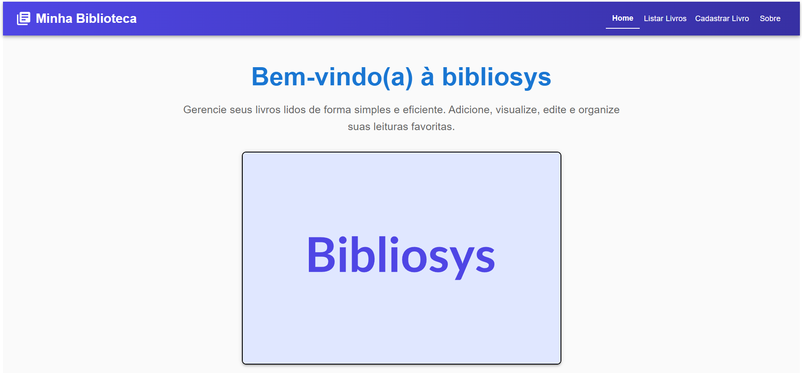
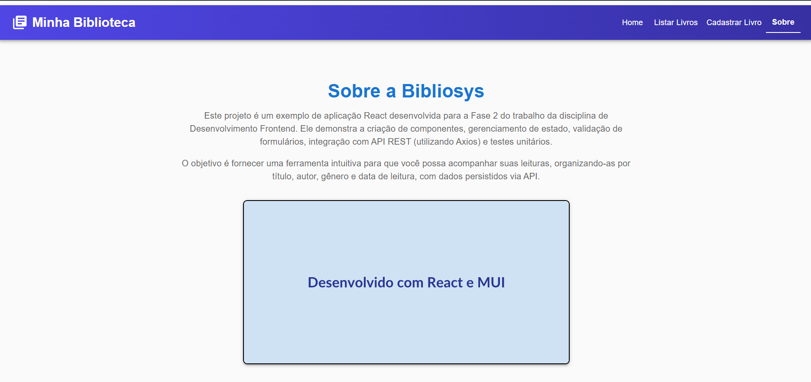
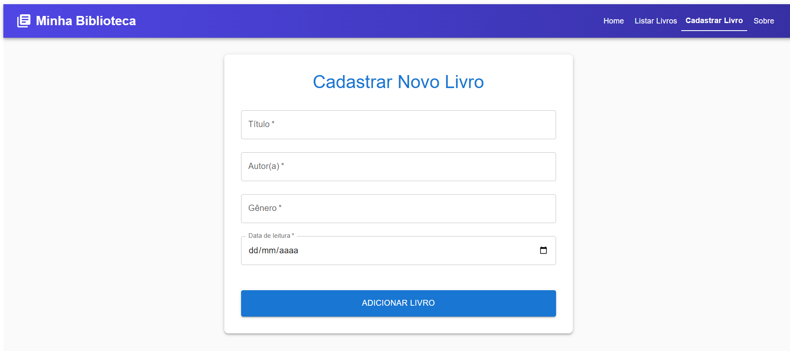
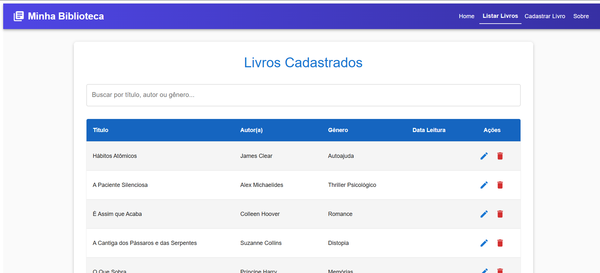

## As principais funcionalidades incluem:

CRUD Completo: Listagem, busca, cadastro, edição e exclusão de livros, com todos os dados gerenciados pela API.

Navegação: Roteamento entre páginas (Home, Sobre, Cadastro, Listagem) utilizando react-router-dom.

Estilização Profissional: Interface de usuário construída com componentes do Material-UI.

Testes Unitários: Cobertura de testes para os componentes principais utilizando Vitest.

## Como Executar o Projeto
Para visualizar e interagir com a aplicação, é fundamental que a API esteja rodando antes de iniciar o frontend.

1. Configurar e Iniciar a API (readingJournal-api)
Clone o Repositório da API: Clone o repositório da API no seu computador:

git clone https://github.com/adsPucrsOnline/DesenvolvimentoFrontend.git

Navegue até a Pasta da API:

cd DesenvolvimentoFrontend/readingJournal-api/

Instale as Dependências da API:

npm install

npm start

2. Configurar e Iniciar o Projeto Frontend (Este Projeto)
Baixe/Navegue até a Pasta do Projeto: Abra um novo terminal e navegue até a pasta raiz deste projeto 

npm install

npm run dev

3. Executar os Testes Unitários
npm test

Cobertura de código:

npm run coverage

## Descrição dos Componentes e Conexão com a API
A aplicação é modularizada em componentes React, e a interação com a API 

Propósito: Componente raiz e orquestrador principal da aplicação.

Funcionalidades: Gerencia o estado global dos livros (carregamento, erros, lista de livros) e coordena todas as operações CRUD (criação, leitura, atualização, exclusão). Implementa o roteamento principal com react-router-dom.

Conexão com a API: É o principal ponto de integração. Utiliza o bookService para:

Buscar todos os livros (bookService.getAllBooks()) ao carregar a aplicação.

Enviar dados para cadastro (bookService.createBook()).

Enviar dados para atualização (bookService.updateBook()).

Buscar um livro específico para edição (bookService.getBookById()).

Realizar a exclusão de livros (bookService.deleteBook()).

NavBar.jsx (src/components/NavBar/NavBar.jsx):

Propósito: Componente de navegação superior da aplicação.

Funcionalidades: Apresenta os links para as diferentes páginas (Home, Listar Livros, Cadastrar Livro, Sobre) e é estilizado com componentes MUI (AppBar, Toolbar, Button).

## BookForm.jsx (src/components/BookForm/BookForm.jsx):

Propósito: Componente de formulário para inclusão ou edição de dados de livros.

Funcionalidades: Contém campos para Título, Autor(a), Gênero e Data de leitura, utilizando TextField do MUI. Implementa validação básica nos campos obrigatórios.

Conexão com a API: Os dados preenchidos são passados para o componente pai (App.jsx) através de uma prop onSubmit, que então os envia para a API.

## BookList.jsx (src/components/BookList/BookList.jsx):

Propósito: Componente para exibir a lista de livros cadastrados.

Funcionalidades: Apresenta os livros em formato de tabela (Table, TableContainer do MUI), inclui um campo de busca para filtrar os resultados localmente e botões para editar/excluir cada item (com ícones MUI).

Conexão com a API: Recebe a lista de livros já carregada pelo App.jsx. As ações de edição e exclusão chamam funções (onEdit, onDelete) passadas via props, que, por sua vez, disparam as requisições à API via App.jsx.

## bookService.js (src/api/bookService.js):

Propósito: Módulo dedicado à comunicação com a API REST.

Funcionalidades: Centraliza todas as chamadas HTTP (GET, POST, PUT, DELETE) para os endpoints da API utilizando a biblioteca Axios. É responsável por lidar com a URL base da API e o tratamento básico de erros nas requisições.

Conexão com a API: É a camada de serviço que abstrai as chamadas HTTP, tornando o restante da aplicação independente dos detalhes de como as requisições são feitas.

## Prints da Aplicação:

## Página Inicial (Home):

## Página Informativa (Sobre):

## Página de Cadastro de Livros:

## Página de Listagem de Livros:

